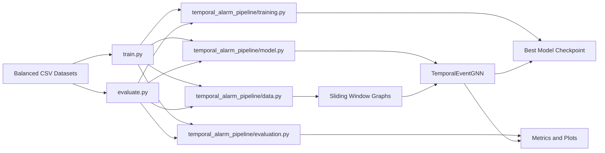
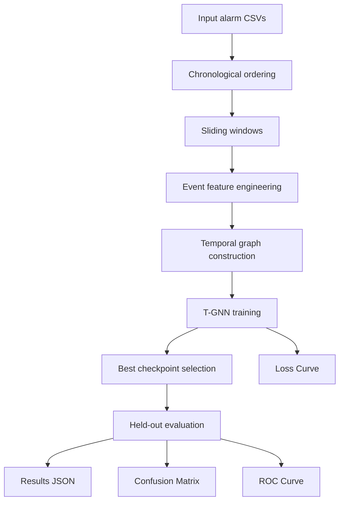

# Temporal Alarm T-GNN: Current Production-Oriented Version

## Executive Summary

This repository contains the current working version of a Temporal Graph Neural Network (T-GNN) pipeline for alarm-stream classification. The active implementation has been refactored from earlier experimental scripts into a cleaner, production-oriented structure with separate entrypoints for training and evaluation and a reusable internal package for data preparation, model logic, training, and reporting.

The current system treats alarm activity as a sequence of events over time, converts sliding windows of those events into graphs, and classifies each graph into one of three operational outcome classes:

- `benign`
- `false_positive`
- `intrusion`

This version is the result of moving away from monolithic experimentation toward a workflow that is easier to run, explain, maintain, and eventually integrate into a larger production pipeline.

At this stage, the live workflow has been validated end to end:

- training runs from a dedicated top-level script
- evaluation runs from a separate dedicated top-level script
- model artifacts and plots are generated automatically
- legacy experiments and outdated documentation have been archived out of the active path

The most recent saved evaluation snapshot in this workspace reports:

- Test accuracy: `0.9839`
- Test macro F1: `0.9852`
- ROC AUC: `1.0000` for `benign`, `0.9932` for `false_positive`, `0.9920` for `intrusion`
- Number of evaluated test graphs: `373`

These results indicate that, on the current balanced synthetic scenario dataset, the model is performing strongly and converging stably.

## Why This Version Matters

Earlier iterations of the project accumulated multiple experimental scripts, alternate model families, older documentation, and historical checkpoint files in the workspace root. That made it harder to answer basic operational questions such as:

- Which file actually trains the model?
- Which file should be used for evaluation?
- Which outputs belong to the current approach versus an older one?
- Which files are safe to ignore for production planning?

This updated version addresses those issues by establishing a clear active path and separating it from historical material.

## What Was Done In This Update

The current state of the repository reflects several important changes:

1. The live T-GNN workflow was refactored into a production-style structure.
2. Training and evaluation responsibilities were split into separate entrypoints.
3. Shared logic was moved into an internal Python package.
4. The active Python modules were documented with inline comments for maintainability.
5. Old experiments, outdated model bundles, obsolete JSON datasets, and stale documentation were moved into an archive area.
6. The current workflow was re-run and validated with generated plots and metrics.

The result is a codebase that is easier for both technical and non-technical stakeholders to interpret.

## Architecture At A Glance

The current implementation is organized so that the top-level scripts remain simple while the reusable logic stays inside the package.



### Stakeholder Interpretation

- the top layer is the operational interface: run training or run evaluation
- the package layer contains the reusable ML logic
- the outputs are a saved model plus figures and metrics for review

This structure reduces confusion, makes maintenance easier, and provides a clearer path toward automation.

## Current Active Workflow

The active workflow is intentionally simple:

1. Prepare or point to the active CSV datasets.
2. Run training with `train.py`.
3. Save the best model checkpoint and diagnostic figures.
4. Run evaluation with `evaluate.py`.
5. Review numeric metrics and generated plots.

### Active Entry Points

- `train.py`: canonical training script for the current model
- `evaluate.py`: canonical evaluation script for the current model

### Active Reusable Package

- `temporal_alarm_pipeline/data.py`: CSV ingestion, labeling, feature engineering, graph construction
- `temporal_alarm_pipeline/model.py`: Temporal GNN model definition
- `temporal_alarm_pipeline/training.py`: loaders, class balancing, optimization loop, checkpointing
- `temporal_alarm_pipeline/evaluation.py`: metrics, confusion matrix generation, ROC plotting, loss plotting

Anything outside that active path should be treated either as generated output or historical material unless explicitly brought back into scope.

### End-to-End Flow



This is the current path stakeholders should associate with the updated version of the project.

## Repository Layout

### Active Runtime Files

- `train.py`
- `evaluate.py`
- `temporal_alarm_pipeline/`
- `requirements.txt`
- current generated artifacts such as the latest `.pt`, `.json`, and `.png` outputs

### Archived/Historical Material

Older scripts, model variants, prior documentation, and retired datasets have been moved under:

- `archive/legacy_experiments/`

This was done to reduce ambiguity and keep the current execution path clean.

## Data Used by the Current T-GNN Pipeline

The current live workflow uses the balanced synthetic CSV datasets under `UUI_synthetic_data_generator/`.

### Active Datasets

- `UUI_synthetic_data_generator/balanced_synthetic_data_train.csv`
- `UUI_synthetic_data_generator/balanced_synthetic_data_validation.csv`
- `UUI_synthetic_data_generator/balanced_synthetic_data_scenario.csv`

### Current Dataset Sizes

Verified in the workspace:

- training rows: `1500`
- validation rows: `1500`
- scenario/test rows: `1500`

### Current Ground-Truth Balance

Each active CSV is class-balanced at the event level:

- `500` benign
- `500` false positive
- `500` intrusion

This balanced configuration is important because earlier project states included splits where at least one class was missing in the training set, which caused the model to collapse or fail to learn a proper three-class boundary.

## Input Schema Expected by the Pipeline

The active CSV files include fields such as:

- `timestamp`
- `event_id`
- `sensor_id`
- `sensor_type`
- `layer`
- `sector`
- `zone`
- `event_type`
- `assessment`
- `scenario_label`
- `ground_truth`
- `assessment_latency_s`
- `actor`
- `meta`

The current implementation relies primarily on the temporal ordering of events and the contextual alarm metadata needed to build graph node features.

## Problem the Model Solves

The goal is to classify windows of alarm activity rather than isolated alarm rows. This matters because many alarms only become interpretable when viewed in sequence.

Instead of treating each event independently, the model asks a more operationally realistic question:

"Given a short sequence of alarm events and their relationships in time and space, does this window look benign, like a false positive, or like an intrusion?"

That framing is what makes a temporal graph approach useful here.

## How the Pipeline Works

## 1. Data Loading and Ordering

The pipeline reads CSV records and sorts them chronologically using the `timestamp` field.

This is a necessary first step because the rest of the system assumes that temporal order carries real signal.

## 2. Sliding Window Construction

The model does not classify the full file at once. Instead, it moves through the event stream with a sliding window.

Current defaults:

- window size: `12`
- stride: `4`

That means each training example is a graph built from 12 sequential alarm events, and neighboring windows overlap.

## 3. Window-Level Labels

Each graph receives one label for the full window.

For the default `ground_truth` scheme, the logic is priority-based:

- if any event in the window is `intrusion`, the whole window is labeled `intrusion`
- otherwise, if any event is `false_positive`, the window is labeled `false_positive`
- otherwise, the window is labeled `benign`

This captures operational severity and makes the model sensitive to the highest-risk event within each temporal segment.

## 4. Feature Engineering

Each event becomes a graph node with a mixed feature set containing categorical context and temporal behavior.

Examples of features used by the current implementation include:

- sensor identity
- sensor type
- layer
- sector
- zone
- actor
- cyclical hour-of-day encoding
- cyclical weekday encoding
- weekend indicator
- seconds since previous event
- seconds since previous event from the same sensor
- normalized position inside the window
- sine/cosine encoding of event position in the window
- whether the previous event came from the same sensor
- whether the previous event came from the same zone
- recent same-sensor ratio within short history
- recent same-zone ratio within short history
- recent sensor density
- recent zone density

This feature design allows the model to combine identity, temporal spacing, local repetition, and positional context.

## 5. Graph Construction

Edges are created to reflect relationships between events.

The current logic connects events when:

- they are adjacent in time and close enough within a maximum time gap
- they come from the same sensor and remain close in time
- they come from the same zone and remain close in time

This graph structure lets the model reason over repeated or related alarm activity rather than only raw row order.

### Deep Dive: How the Model Operates on the Dataset

The best way to understand the current pipeline is to follow one dataset from raw CSV rows to one final model prediction.

### Step A: Read and sort records

Each CSV file is read as tabular alarm events, then globally sorted by `timestamp`.

Why this matters:

- the graph is temporal by design, so event order is part of the signal
- all downstream windows and edges assume this order is correct

### Step B: Create overlapping windows

The sorted stream is segmented into windows of fixed length.

With defaults:

- window size = `12`
- stride = `4`

If the event stream has $N$ rows, the approximate number of windows is:

$$
	ext{num_windows} = \left\lfloor\frac{N - W}{S}\right\rfloor + 1
$$

Where:

- $W$ is window size
- $S$ is stride

This overlap means one alarm event can influence multiple neighboring graphs, which smooths local noise and improves temporal context.

### Step C: Convert each event in a window into a node

Within each window, every row becomes one graph node.

Node features are built from:

- categorical context (`sensor_id`, `sensor_type`, `layer`, `sector`, `zone`, `actor`)
- cyclical time encodings (hour/day sin-cos)
- relative timing (`seconds_since_previous`, `seconds_since_same_sensor`)
- local pattern indicators (`same_sensor_as_prev`, `same_zone_as_prev`)
- short-history density/ratio features
- normalized index position within the window

All per-node feature dictionaries are vectorized into dense numeric tensors before graph assembly.

### Step D: Assign one label to the full window

The current default uses `ground_truth` with priority aggregation:

1. if any event is `intrusion`, label the window `intrusion`
2. else if any event is `false_positive`, label the window `false_positive`
3. else label the window `benign`

This creates graph-level supervision aligned with incident-severity logic.

In plain language, this step turns many event labels inside one window into one final window label:

1. read all event labels in the window
2. if at least one is `intrusion`, the full window is `intrusion`
3. otherwise, if at least one is `false_positive`, the full window is `false_positive`
4. otherwise, the full window is `benign`

This is a priority rule:

- `intrusion` has highest priority
- `false_positive` has middle priority
- `benign` has lowest priority

Why this rule is used:

- it preserves the highest-risk signal inside each time window
- it avoids drowning out rare intrusions when most events in the same window are benign

Examples:

- `[benign, benign, intrusion, benign]` -> window label is `intrusion`
- `[benign, false_positive, benign]` -> window label is `false_positive`
- `[benign, benign, benign]` -> window label is `benign`

### Step E: Build edges inside each window graph

Edges are generated by two complementary rules and stored as directed pairs in `edge_index`.

#### Rule 1: Temporal adjacency edges

For each consecutive pair $(i, i+1)$ in a window:

- compute $\Delta t = |t_{i+1} - t_i|$
- if $\Delta t \leq \text{max_time_gap_s}$, add both directions:
	- $(i, i+1)$
	- $(i+1, i)$

Default `max_time_gap_s` is `3600` seconds.

Interpretation: immediate neighbors in time are explicitly connected so attention can pass along the event sequence.

#### Rule 2: Contextual similarity edges (same sensor or same zone)

For each node $i$, the builder scans prior nodes $j < i$ in the window.

If both conditions hold:

1. $|t_i - t_j| \leq \text{max_time_gap_s}$
2. `sensor_id_i == sensor_id_j` OR `zone_i == zone_j`

then it adds bidirectional edges:

- $(i, j)$
- $(j, i)$

Interpretation: this links non-adjacent events that are operationally related, such as repeated triggers from the same sensor or repeated activity in the same zone.

#### Rule 3: Fallback self-links when no edges exist

If no edges were added by Rules 1 and 2, the builder creates identity links so each node remains reachable by the graph ops.

This avoids empty-edge failures in downstream GNN layers.

#### Duplicate-edge handling

After edge generation, duplicate pairs are removed before conversion to tensors.

This keeps the graph compact and prevents repeated identical connections from over-weighting specific paths.

### Step F: Add position signal for node order

A normalized position vector is attached to each node:

$$
	ext{pos}_i = \frac{i}{(W-1)}
$$

This value is later transformed into sinusoidal positional encoding in the model and concatenated with node features. It gives the network explicit ordering information beyond edge structure.

### Step G: Run the graph through TemporalEventGNN

For each batched graph:

1. node features + positional encoding are projected to hidden space
2. `GATConv` layer 1 propagates local attention-weighted context
3. `GATConv` layer 2 refines node embeddings
4. global mean pooling aggregates node states to one graph embedding
5. an MLP classifier outputs class logits

Softmax over logits gives class probabilities; argmax gives predicted class.

### Step H: Train, validate, and checkpoint

During training:

- weighted cross-entropy addresses class imbalance at graph level
- validation metrics are computed each epoch
- best model is selected by highest validation macro F1
- learning rate is reduced on plateaus

This makes the selected checkpoint quality-driven, not just epoch-driven.

### Worked mini-example of edge building

Suppose one window has four ordered events: `e0, e1, e2, e3`.

Assume:

- `e0` and `e1` are adjacent in time and inside gap threshold
- `e1` and `e2` are adjacent in time and inside gap threshold
- `e2` and `e3` are adjacent in time and inside gap threshold
- `e0` and `e2` share the same zone and are inside gap threshold
- `e1` and `e3` share neither sensor nor zone

Then edges include:

- adjacency links: `(0,1),(1,0),(1,2),(2,1),(2,3),(3,2)`
- contextual link: `(0,2),(2,0)`

No edge is added for `(1,3)` because similarity condition fails.

This example shows how the graph captures both immediate timeline continuity and repeated operational context.

## 6. Model Architecture

The active model is `TemporalEventGNN`.

High-level architecture:

1. Input features are concatenated with positional encodings.
2. A linear projection maps them into hidden space.
3. Two graph attention layers (`GATConv`) propagate information across the event graph.
4. Graph-level pooling aggregates node embeddings into a single window representation.
5. A feedforward classifier outputs the final class logits.

Default configuration:

- hidden dimension: `64`
- attention heads: `4`
- dropout: `0.25`

This design is a reasonable fit for temporal alarm streams because it preserves local event detail while also learning cross-event relationships.

## 7. Training Strategy

The training loop includes several practical safeguards:

- deterministic seeds for reproducibility
- inverse-frequency class weighting
- optional graph rebalancing for the three-class problem
- best-checkpoint saving based on validation macro F1
- learning-rate reduction on validation plateaus

For `ground_truth` training, the code rebalances graph windows so that no class is ignored simply because it appears less often after window aggregation.

The checkpoint that is preserved is the one with the best validation macro F1, not merely the last epoch.

## 8. Evaluation Strategy

Evaluation is intentionally separated from training.

That separation is important for production readiness because it makes it easier to:

- test a saved model independently
- re-run reporting without retraining
- integrate evaluation into downstream automation
- avoid mixing training state and test logic in a single file

The evaluation step:

1. rebuilds the feature vectorizer from training data
2. applies the same feature space to held-out test/scenario data
3. loads the saved checkpoint
4. computes accuracy, macro F1, confusion matrix, classification report, and ROC curves
5. writes a machine-readable JSON summary

One important correctness fix in this refactored workflow is that evaluation first fits the vectorizer on training data before transforming test data. That keeps feature dimensions aligned and avoids invalid train/evaluation mismatch.

## Why Separate `train.py` and `evaluate.py`

This was a deliberate architecture decision.

### `train.py` exists to:

- load training and validation data
- build graph datasets
- train the model
- select the best checkpoint
- generate core diagnostic plots

### `evaluate.py` exists to:

- load an already trained model
- build test graphs using the correct feature space
- produce objective evaluation metrics
- save results for reporting and review

In other words:

- `train.py` answers: "How do we fit the model?"
- `evaluate.py` answers: "How well does the saved model perform on held-out data?"

This is closer to what stakeholders should expect in a production ML workflow.

## Current Commands

### Train with defaults

```bash
python train.py
```

### Train for 100 epochs

```bash
python train.py --epochs 100
```

### Train with a larger batch size

```bash
python train.py --batch-size 32
```

### Evaluate the saved model

```bash
python evaluate.py
```

## Main Training Parameters

The current CLI supports controlling:

- train CSV path
- validation CSV path
- test CSV path in evaluation
- label field
- window size
- stride
- hidden dimension
- attention heads
- dropout
- epochs
- batch size
- learning rate
- weight decay
- output prefix
- seed
- device

This makes the current pipeline usable for repeatable experiments without editing code each time.

## Generated Outputs

The active workflow produces both model artifacts and reporting artifacts.

### Model Artifact

- `temporal_alarm_tgnn_best_model.pt`

### Evaluation Summary

- `temporal_alarm_tgnn_results.json`

### Plots

- `temporal_alarm_tgnn_loss_curve.png`
- `temporal_alarm_tgnn_confusion_matrix.png`
- `temporal_alarm_tgnn_roc_curve.png`

These artifacts are useful for different audiences:

- engineers can inspect the checkpoint and rerun evaluation
- analysts can review the JSON metrics
- stakeholders can use the plots for model behavior discussion and presentation material

## Current Performance Snapshot

The current saved evaluation result in `temporal_alarm_tgnn_results.json` reports:

- accuracy: `0.9839142091152815`
- macro F1: `0.9852265540911241`
- evaluated graphs: `373`

### Confusion Matrix

Rows are true labels and columns are predicted labels.

| True class | Predicted benign | Predicted false_positive | Predicted intrusion |
| --- | ---: | ---: | ---: |
| benign | 88 | 0 | 0 |
| false_positive | 1 | 139 | 1 |
| intrusion | 0 | 4 | 140 |

### Interpretation

- benign windows were classified perfectly in the saved result
- false positives were classified very strongly with only 2 errors out of 141
- intrusion windows were also classified strongly, with 4 intrusions predicted as false positives

Operationally, this suggests the model is already separating the three classes well on the current balanced synthetic scenario data.

### ROC AUC Snapshot

- benign: `1.0000`
- false_positive: `0.9932`
- intrusion: `0.9920`

Those are very strong one-vs-rest discrimination scores for the current dataset.

## Loss Curve Interpretation

The current saved loss curve shows the pattern expected from a stable training run:

- training loss drops quickly early in training
- validation loss also falls and then stabilizes
- the two curves remain relatively close to each other
- the model appears to converge rather than diverge

This indicates:

- optimization is stable
- the model is learning useful signal
- there is no obvious severe overfitting in the saved run

## What Stakeholders Should Take From the Current Results

At a high level, the current project has moved from exploratory scripting to a clearer ML pipeline that is easier to explain and operate.

For stakeholders, the important outcomes are:

1. There is now a single active training path and a single active evaluation path.
2. The model produces stakeholder-friendly reporting artifacts automatically.
3. The current balanced synthetic benchmark produces strong performance.
4. The repository has been cleaned so older approaches no longer obscure the live workflow.

This means the project is in a much better state for review, handoff, and future integration work than it was before the refactor.

## Known Limitations

The current results should be interpreted carefully.

### 1. Synthetic-data dependence

The current strong metrics come from balanced synthetic data. That is useful for controlled development and debugging, but it does not automatically guarantee equal performance on real-world alarm streams.

### 2. Window-level labeling

The model predicts a label for a window of events, not a single raw row in isolation. That is a design choice, but stakeholders should understand that output semantics are sequence-based.

### 3. Evaluation scope

The current evaluation is strong for the active scenario split, but future production readiness will require testing across additional scenarios, shift conditions, and potentially noisier or more realistic data.

### 4. Production integration is not yet complete

The code structure is now production-oriented, but this repository is still a development-stage ML project rather than a fully deployed production service.

Examples of work still outside the current scope include:

- model serving API design
- automated retraining orchestration
- model registry integration
- data validation and monitoring in deployment
- drift detection and post-deployment alerting

## Why the Archive Matters

The `archive/legacy_experiments/` folder is not just cleanup. It preserves traceability.

It allows the team to:

- keep historical experiments for reference
- compare current and prior approaches if needed
- reduce confusion in the active workspace
- avoid deleting work that may still have research value

This is especially important in ML projects, where historical experiments often contain useful context even after they are no longer part of the active path.

## Environment and Dependencies

This repository is currently using:

- Python 3.10.12 in a local `.venv`
- PyTorch
- PyTorch Geometric
- scikit-learn
- matplotlib
- NumPy
- PyYAML

See `requirements.txt` for the installed dependency list in this workspace.

## Recommended Near-Term Next Steps

The most sensible next steps for this project are:

1. evaluate on additional synthetic scenario variations to test robustness
2. test against less curated or more operationally realistic data
3. define the target inference interface for production use
4. add formal experiment/version tracking for metrics and artifacts
5. decide whether the next milestone is batch inference, near-real-time inference, or full deployment

## Quick Start

If someone new to the project needs the shortest operational path:

```bash
python train.py --epochs 100
python evaluate.py
```

Then review:

- `temporal_alarm_tgnn_results.json`
- `temporal_alarm_tgnn_loss_curve.png`
- `temporal_alarm_tgnn_confusion_matrix.png`
- `temporal_alarm_tgnn_roc_curve.png`

## Bottom Line

This version now has:

- a clean active execution path
- documented internal modules
- separate training and evaluation stages
- archived legacy clutter
- strong current benchmark results
- artifacts that can be shown to technical and non-technical stakeholders

That does not mean the model is fully productionized yet, but it does mean the project now has a credible foundation for the next stage of engineering and stakeholder review.

## Acknowledgements
This work was supported by the Laboratory Directed Research and Development program (Project 240551) at Sandia
National Laboratories, a multimission laboratory managed and operated by National Technology and Engineering
Solutions of Sandia LLC, a wholly owned subsidiary of Honeywell International Inc. for the U.S. Department of
Energy’s National Nuclear Security Administration under contract DE-NA0003525.